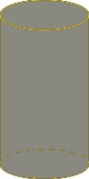
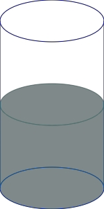
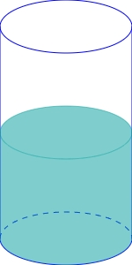

### 使用方式

```
import CylinderProgress from 'vue-cylinder-progress'
import 'vue-cylinder-progress/vue-cylinder-progress.css'

  <CylinderProgress
   :percent="percent"
   :cylinderHeight="100 / 6"
   :invisableDashed="true"
   containerColor="gold"
   progressColor="rgba(156, 156, 0, 0.5)"
   :width="100"
   :height="200">
   </CylinderProgress>
	
```
### 字段说明
|字段|类型|版本|说明|
|  ----  |  ----  | ----  | ----  |
|percent|Number|1.0.0|当前进度，[0 - 1]之间|
|cylinderHeight|Number|1.0.0|用于调整切斜程度，建议取width的1/5左右|
|invisableDashed|Boolean|1.0.0|看不见的边框是否虚化|
|containerColor|String|1.0.0|容器颜色|
|progressColor|String|1.0.0|进度颜色|
|width|Number|1.0.0|组件宽度|
|height|Number|1.0.0|组件高度|


### 示例图1


### 示例图2


### 示例图3

