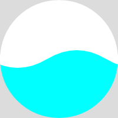
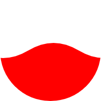

### 使用方式

```
import TLWaveView from 'vue-waveview'
import 'vue-waveview/vue-waveview.css'

  <div style="width: 200px;height: 200px;">
    <TLWaveView
     :waveAmplitude="waveAmplitude"
     :waveHeight="waveHeight"
     :width="200"
     :height="200"
     bgColor="gainsboro"
     :isCycle="true"
     :styleObj="{border: '1px solid white', borderRadius: '50%'}"
     waveColor="rgba(0, 255, 255, 255)"
    ></TLWaveView>
  </div>
	
```
### 字段说明
|字段|类型|版本|说明|
|  ----  |  ----  | ----  | ----  |
|isCycle|Boolean|1.1.0|是否圆形化，组件长宽一样才有效|
|waveColor|String|1.0.3|水波纹的颜色|
|bgColor|String|1.0.1|组件背景，默认为white，圆形化才会有效|
|styleObj|Object|1.0.1|样式对象，例如添加圆边框、使组件圆形化|
|waveHeight|Number|1.0.1|波纹高度，介于0到组件高度之间|
|waveAmplitude|Number|1.0.1|波纹振幅，默认等于1/4组件宽度|


### 示例图1
###### 圆形化会出现背景色，可设置bgColor颜色进行调节


### 示例图2


### 示例图3


### 示例图4
